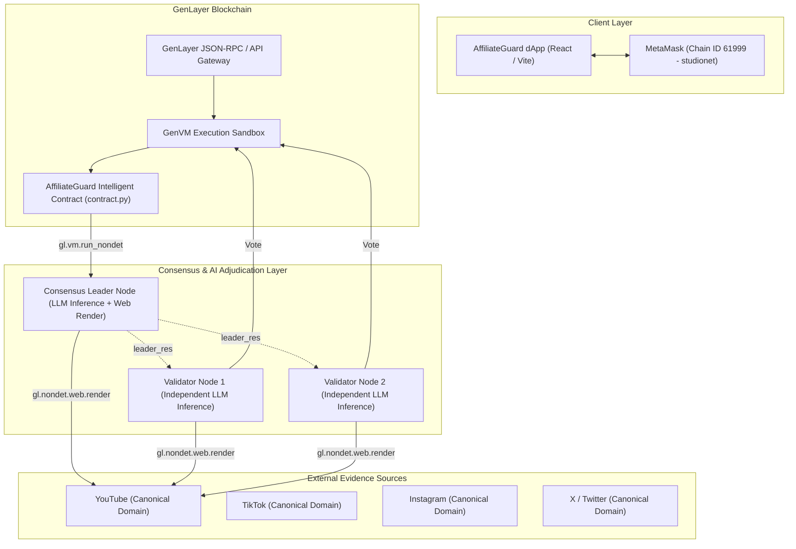
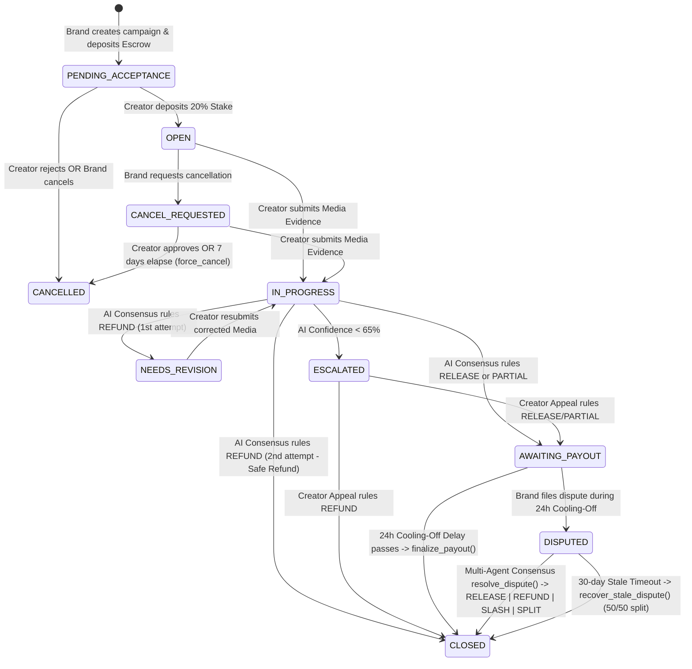

# AffiliateGuard Architecture & Technical Specification

## Overview

**AffiliateGuard** is a decentralized affiliate marketing escrow protocol designed specifically for the **GenLayer Intelligent Contract** architecture. It eliminates manual escrow disputes and single-party custody by using multi-agent LLM consensus nodes directly at the blockchain consensus layer.

Traditional smart contracts on EVM (Solidity) cannot inspect off-chain rich media without centralized, trusted oracles. AffiliateGuard operates natively on GenLayer to execute non-deterministic web retrieval and multi-agent subjective consensus with strict mathematical guarantees against hallucinations and scraper unreliability.

---

## High-Level System Architecture



---

## Campaign Lifecycle State Machine



---

## Key Protocols & Safeguards

### 1. Canonical Host Verification
- Prevents substring injection attacks such as `attacker.com/youtube.com` or unauthenticated pastebins.
- The contract strictly parses fully-qualified domain names (`_extract_domain`) and enforces membership against verified platforms (`youtube.com`, `youtu.be`, `tiktok.com`, `instagram.com`, `x.com`, `twitter.com`).

### 2. On-Chain Creator Identity Registry
- Creators register their verified social handle on-chain (`register_creator_handle`).
- When a video is submitted, platform metadata (`author_metadata`, oEmbed, author channel) must cryptographically or structurally bind to the registered handle.

### 3. Non-Inference Evidence Boundary
- Plain text scraped from an HTML webpage cannot certify 2D visual pixels or verify that a logo actually appeared on screen.
- If a brand logo is required, plain scraped text is strictly capped at `PARTIAL` rather than `RELEASE`, enforcing a mandatory 24-hour brand inspection period.
- High-assurance `RELEASE` requires authenticated structured evidence (`captions`, `visual_proof`, `author_metadata`).

### 4. Ownerless Multi-Agent Slashing
- No single owner or admin key can seize funds or slash creator stakes.
- Dispute resolution (`resolve_dispute`) invokes `gl.vm.run_nondet`, where independent validator nodes evaluate the dispute evidence against consensus rules:
  - `RELEASE`: Dispute unfounded; creator receives 100% escrow + full stake.
  - `REFUND`: Requirements unmet without fraud; brand receives 100% escrow, creator stake returned.
  - `SLASH`: Malicious fraud proven by structured forensic evidence; brand receives escrow + slashed creator stake.
  - `SPLIT`: Ambiguous evidence or mutual fault; escrow split 50/50, stake returned.

### 5. Stale Dispute Protection
- If a dispute is left unresolved for more than 30 days (`2,592,000` seconds), anyone can trigger `recover_stale_dispute()`, which splits escrow 50/50 and returns the creator's stake.

---

## Equivalence Principle Implementation

```python
def leader_fn():
    # 1. Fetch web content or structured proof inside nondet
    # 2. Construct multi-perspective prompt
    # 3. Request JSON execution from GenLayer LLM
    return parsed_llm_json

def validator_fn(leader_res) -> bool:
    if not isinstance(leader_res, gl.vm.Return):
        return False
    leader_data = leader_res.calldata
    mine_data = leader_fn()
    # Semantic verification: Compare VERDICT ONLY, ignoring wording variations in 'reason'
    return str(leader_data.get("verdict")).upper() == str(mine_data.get("verdict")).upper()

result = gl.vm.run_nondet(leader_fn, validator_fn)
```
This pattern ensures that minor phrasing variations in LLM explanations do not cause consensus deadlocks, while guaranteeing absolute agreement on financial outcomes.
